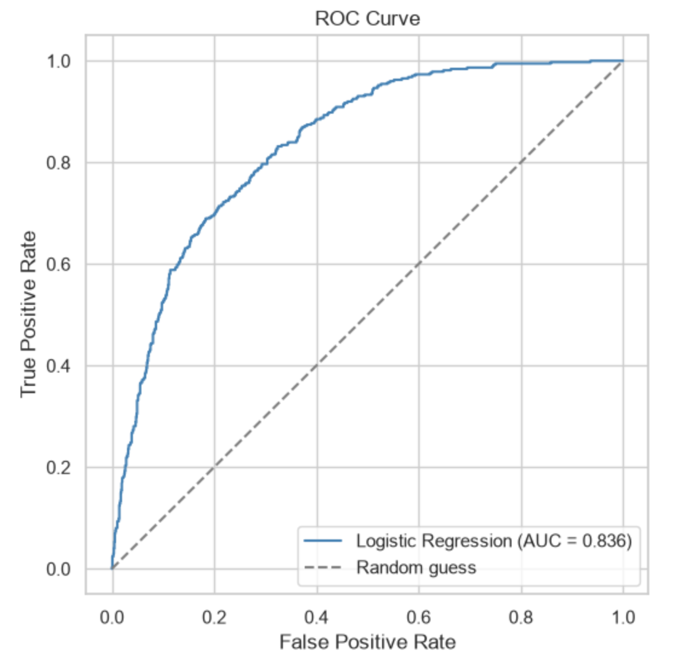
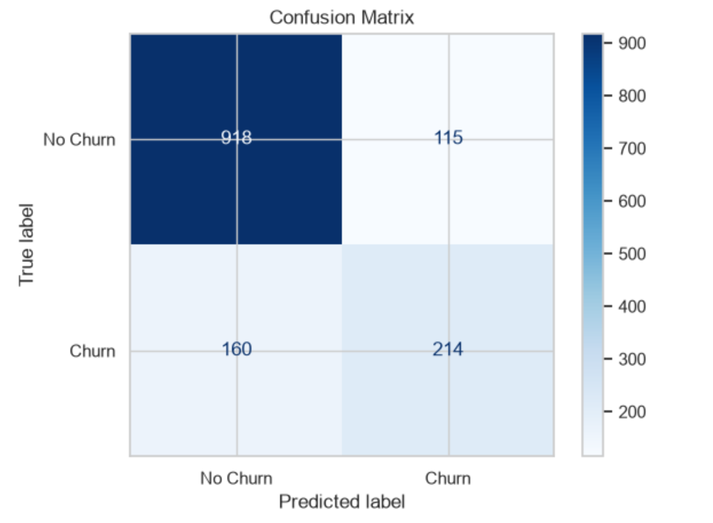
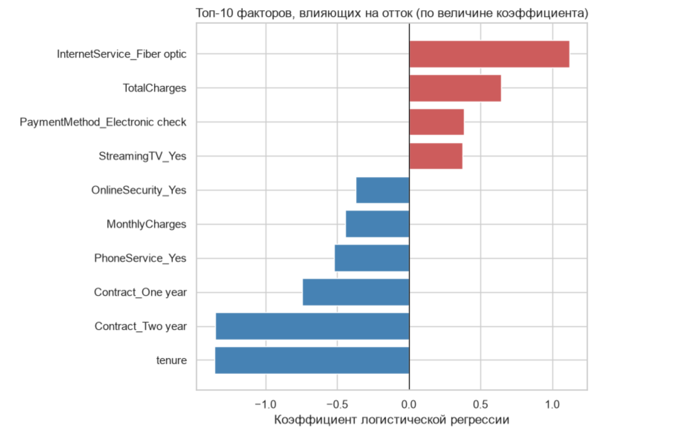

# telco-churn-logistic-regression-project

# Telco Customer Churn: предсказание оттока (логистическая регрессия)

Pet-проект: построение и интерпретация модели логистической регрессии для предсказания оттока клиентов телеком-компании.

## Датасет
[Telco Customer Churn](https://www.kaggle.com/datasets/blastchar/telco-customer-churn) с Kaggle — 7043 клиента, 21 признак (демография, подключённые услуги, тип контракта, способ оплаты). Целевая переменная — `Churn` (ушёл клиент или нет).

## Инструменты
Python, pandas, scikit-learn, matplotlib, seaborn, Jupyter Notebook

## Структура репозитория
- `notebooks/churn_prediction.ipynb` — полный pipeline: EDA → очистка данных → кодирование признаков → обучение модели → оценка качества → интерпретация коэффициентов
- `images/` — ключевые графики (EDA, confusion matrix, ROC-кривая, топ-факторы риска)

## Подготовка данных
- Удалены 11 строк с некорректным значением `TotalCharges` (пробел вместо числа — клиенты с `tenure = 0`, ещё не имеющие истории начислений)
- Категориальные признаки закодированы через One-Hot Encoding (`drop_first=True`, чтобы избежать мультиколлинеарности)
- Числовые признаки (`tenure`, `MonthlyCharges`, `TotalCharges`) стандартизированы через `StandardScaler`
- Train/test split (80/20) со стратификацией по целевой переменной — доля оттока в обеих выборках идентична (26.58%)

## Качество модели

| Метрика | Значение |
|---|---|
| ROC-AUC | 0.836 |
| Accuracy | 0.80 |
| Precision (Churn) | 0.65 |
| Recall (Churn) | 0.57 |
| F1-score (Churn) | 0.61 |

Базовый уровень оттока в датасете — 26.5% (дисбаланс классов), поэтому recall и precision для класса Churn показательнее, чем общая accuracy: модель, которая всегда предсказывает "клиент останется", получила бы accuracy ≈ 73.5%, не предсказывая при этом ничего полезного.

## Ключевые факторы оттока

**Повышают риск оттока:**
- Оптоволоконный интернет (Fiber optic) — шансы оттока почти в **3 раза выше**, чем при отсутствии интернета (odds ratio ≈ 3.07)
- Высокий `TotalCharges`
- Оплата через Electronic check
- Подключённый Streaming TV

**Снижают риск оттока:**
- Длительный стаж (`tenure`) — самый сильный удерживающий фактор
- Долгосрочный контракт: двухлетний снижает шансы оттока почти в 4 раза, годовой — примерно вдвое (относительно месячного контракта)
- Подключённая услуга Online Security

## Бизнес-выводы

Портрет клиента высокого риска: **месячный контракт + оптоволоконный интернет + оплата Electronic check + отсутствие Online Security**.
Именно на этот сегмент имеет смысл в первую очередь направлять программы удержания — например, предлагать переход на длительный контракт или подключение услуг безопасности со скидкой.

Модель находит немногим больше половины (57%) реальных случаев оттока — для практического использования в бизнесе стоит рассмотреть понижение порога классификации (ниже 0.5) там, где цена пропущенного оттока выше цены ложной тревоги, либо тестирование более сложных моделей (Random Forest, Gradient Boosting) в качестве следующего шага.
